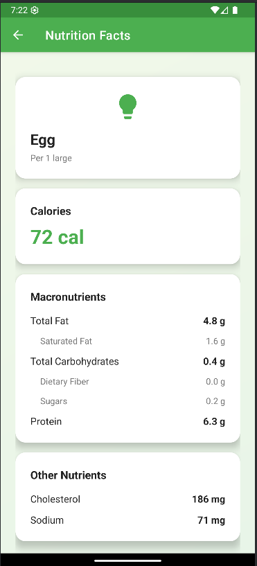

# Food Nutrition App

An Android application that allows users to easily learn the nutritional values of foods and develop healthy eating habits.

## Application

Main screen:  


Nutrition facts result:  



## Features

- Food nutrition value search
- Detailed nutrition information display
- Informative error messages for invalid input

## Installation

### Requirements

- Android Studio (Arctic Fox or newer recommended)
- Java JDK 8 or higher
- Android device or emulator

### Setup Steps

1. Clone this repository:
    ```bash
    git clone github.com/yusufyzzc/food-nutrition-app
    ```
2. Open the project with Android Studio.
3. Make sure all dependencies are automatically installed.
4. Select a device or emulator and run the project.
