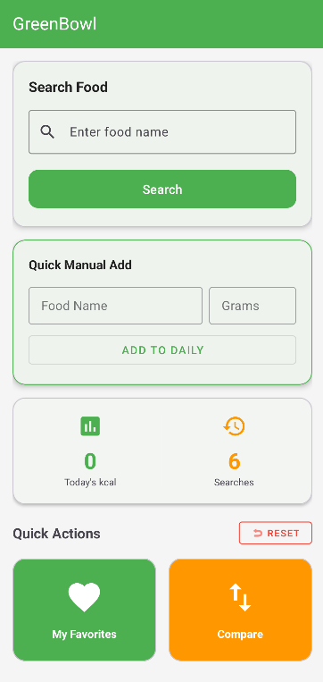
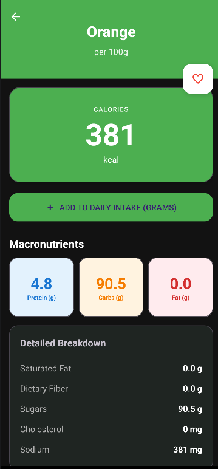
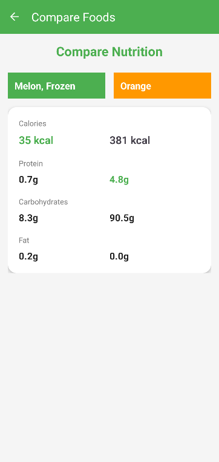

# GreenBowl - Food Nutrition Tracker

A Android application for tracking food nutrition, comparing nutritional values and managing daily dietary intake. Built with modern Android architecture and best practices.

## Features

### Core Functionality
- **Food Search & Database** - Search through extensive food database with detailed nutritional information
- **Nutritional Tracking** - Monitor daily calorie and macronutrient intake
- **Food Comparison** - Compare nutritional values between different foods side-by-side
- **Favorites Management** - Save and quick-access your frequently used foods
- **Quick Add** - Manually add foods with custom portion sizes
- **Daily Dashboard** - Visual overview of today's calorie intake and search history

### UX
- **Dark Mode Support** - Comfortable viewing in low-light environments
- **Responsive Design** - Optimized layouts for various screen sizes
- **Intuitive Navigation** - Easy-to-use interface for quick food logging

##  Application

  
  
  

## API Information

- **USDA API Key:** Included in the source code
- **Database:** USDA FoodData Central API for comprehensive food nutritional data

##  QA

- **Unit Tests:** 10+ comprehensive unit tests
- **UI Tests:** 11+ UI automation tests
- **Test Framework:** AndroidX Test, JUnit, Espresso

##  Tech Stack

- **Language:** Kotlin/Java
- **Build System:** Gradle
- **Architecture:** Modern Android Architecture (MVVM/Clean Architecture)
- **Testing:** AndroidX Test, Espresso, JUnit

